# AWS IoT Core Firehose

Terraform configuration for routing AWS IoT Core MQTT messages to Amazon Kinesis Data Firehose for storage in Amazon S3.

## Overview

This repository contains Terraform code to:
- Create an AWS IoT Topic Rule that captures all MQTT messages
- Configure an IAM role for the IoT service to access Kinesis Firehose
- Set up the necessary permissions with least-privilege access

## Architecture

The solution implements the following data flow:

```mermaid
graph LR
    A["📡 AWS IoT Core<br/>(MQTT)"] -->|MQTT Messages| B["⚙️ Topic Rule<br/>(iot_kinesis_s3_alltopics)"]
    B -->|SELECT * FROM<br/>$aws/rules/#| C["🔥 Kinesis Data<br/>Firehose<br/>(Delivery Stream)"]
    C -->|Batch & Compress| D["💾 Amazon S3<br/>(Data Lake)"]

    E["🔐 IAM Role<br/>(iot_topic_firehose_analytics_role)"]
    E -->|Assumes| B
    E -->|Permissions| C

    style A fill:#FF9900,stroke:#232F3E,stroke-width:2px,color:#fff
    style B fill:#FF9900,stroke:#232F3E,stroke-width:2px,color:#fff
    style C fill:#FF9900,stroke:#232F3E,stroke-width:2px,color:#fff
    style D fill:#FF9900,stroke:#232F3E,stroke-width:2px,color:#fff
    style E fill:#146EB4,stroke:#232F3E,stroke-width:2px,color:#fff
```



## Prerequisites

- Terraform >= 1.0
- AWS CLI configured with appropriate credentials
- An existing Kinesis Data Firehose delivery stream named `mqtt-kinesis-firehose-stream-s3`
- Appropriate IAM permissions to create IoT rules and IAM roles

## Resources

### `aws_iot_topic_rule.rule`
Routes all MQTT messages to Kinesis Firehose with newline separators.
- **Name**: `iot_kinesis_s3_alltopics`
- **SQL Filter**: `SELECT * FROM '$aws/rules/#'`
- **Output**: Kinesis Firehose stream with newline-delimited records

### `aws_iam_role.iot`
Service role for AWS IoT to assume, allowing it to access Firehose.
- **Name**: `iot_topic_firehose_analytics_role`
- **Trust Policy**: Allows `iot.amazonaws.com` service to assume the role

### `aws_iam_role_policy.iot_firehose`
Inline policy granting specific Firehose permissions (least-privilege):
- `firehose:PutRecord` - Write individual records
- `firehose:PutRecordBatch` - Write batch records
- Limited to the specific Firehose delivery stream ARN

## Configuration

Before deploying, ensure:
1. The Kinesis Firehose delivery stream `mqtt-kinesis-firehose-stream-s3` exists
2. The delivery stream is configured with S3 as the destination
3. Your AWS credentials are configured in your environment or AWS CLI

## Deployment

1. Initialize Terraform:
```bash
terraform init
```

2. Review the plan:
```bash
terraform plan
```

3. Apply the configuration:
```bash
terraform apply
```

## Usage

Once deployed:
1. Any MQTT messages published to AWS IoT Core will be captured by the topic rule
2. Messages are sent to the Kinesis Firehose stream with newline separators
3. Firehose will batch and compress records before writing to S3

## Security Considerations

- The IAM policy uses least-privilege access (specific Firehose actions only)
- The SQL filter captures all topics under `$aws/rules/#`
- Consider modifying the SQL filter to capture only specific topics in production
- The role is scoped to the specific Firehose delivery stream ARN

## Customization

### Change the MQTT Topic Filter
Edit the `sql` parameter in `aws_iot_topic_rule.rule` to capture specific topics:
```hcl
# Capture only temperature sensor topics
sql = "SELECT * FROM 'sensors/temperature/+'"
```

### Modify the Output Format
Update the `separator` parameter to use a different delimiter:
```hcl
separator = ","  # For comma-separated values
```

## Troubleshooting

- **Topic Rule Not Working**: Verify the Firehose stream exists and the IAM role has permissions
- **Data Not Appearing in S3**: Check Firehose delivery stream configuration and buffer settings
- **Terraform Errors**: Ensure AWS credentials have permissions to create IoT and IAM resources

## References

- [AWS IoT Topic Rules Documentation](https://docs.aws.amazon.com/iot/latest/developerguide/iot-rules.html)
- [Kinesis Data Firehose Documentation](https://docs.aws.amazon.com/kinesis/latest/dev/what-is-this-service.html)
- [Terraform AWS IoT Topic Rule](https://registry.terraform.io/providers/hashicorp/aws/latest/docs/resources/iot_topic_rule)
- [Terraform AWS IAM Role](https://registry.terraform.io/providers/hashicorp/aws/latest/docs/resources/iam_role)

## License

This project is provided as-is for reference and educational purposes.
